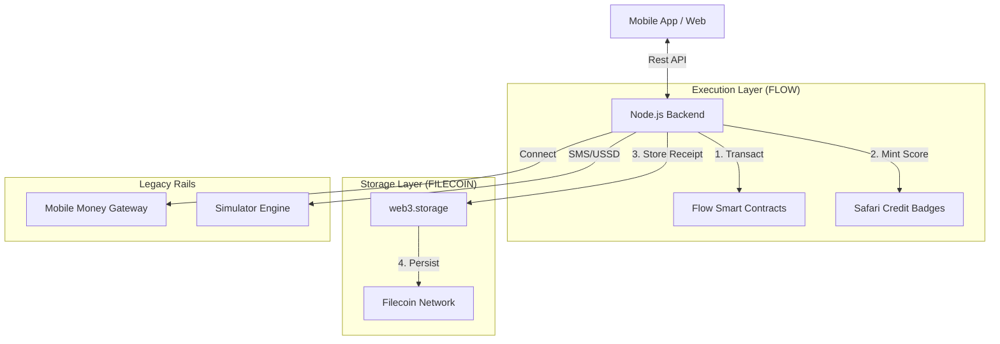

<div align="center">
  
  <h1>🦁 SafariPay</h1>
  <p><b>Africa's Unified Digital Economy on Flow & Filecoin</b></p>
  <p>Rapid P2P Payments · Decentralized Credit · Micro-Loans · On/Off-Ramp</p>

  [](https://protocol.ai)
  [](https://flow.com)
  [](https://filecoin.io)
</div>

---

## 📖 Overview
**SafariPay** is a next-generation financial ecosystem designed to bridge the gap between traditional mobile money and the decentralized world. Built for the unbanked and underbanked populations of Africa, we leverage **Flow** for lightning-fast, consumer-grade transactions and **Filecoin** for permanent, immutable receipt storage and identity verification.

SafariPay solves the critical issues of financial exclusion and lack of credit history by transforming transaction data into verifiable on-chain assets.

---

## ✨ Core Features
- **⚡ High-Speed P2P Payments (Flow)**: Execute near-instant money transfers across borders with minimal fees using Flow's consumer-focused blockchain architecture.
- **📜 Decentralized Receipt Storage (Filecoin)**: Every transaction generates a cryptographically signed receipt stored permanently on Filecoin (via web3.storage), providing an unmanipulatable audit trail.
- **🔍 CID Verification**: Users can verify any transaction's integrity using its Content Identifier (CID). This allows for decentralized dispute resolution without middleman trust.
- **📊 Real-Time Credit Scoring**: A proprietary AI engine calculates creditworthiness based on transaction history and mobile money habits, anchoring scores as Soulbound Tokens (NFTs) on Flow.
- **💸 Decentralized Micro-Loans**: Automated lending pools that disburse funds based on your "Safari Score," with repayment logic built into incoming transfers.
- **🔄 On-Ramp & Off-Ramp**: Seamless integration with local mobile money providers (M-Pesa, Tigo Pesa) for easy entry and exit between fiat and stablecoins.

---

## 🏗 System Architecture
SafariPay utilizes a hybrid architecture to balance Web2 user experience with Web3 transparency and security.

### 🛡️ The Flow & Filecoin Roles
- **Flow Layer**: Handles all state-changing financial events. From user wallet provisioning to P2P settlement and Credit NFT minting. Flow provides the high throughput and low gas fees required for a mainstream financial app.
- **Filecoin Layer**: Serves as the "Truth Layer." Transaction metadata, KYC documents, and encrypted audit logs are anchored to Filecoin. This ensures that even if our backend disappears, the user's financial record remains independently verifiable via CID.



---

## 🛠 Tech Stack
- **Web3 Engine**: Flow Blockchain (FCL SDK, Cadence)
- **Immutable Storage**: Filecoin (web3.storage / IPFS)
- **Frontend**: React 18, Vite, Vanilla CSS (Premium Glassmorphism)
- **Backend API**: Node.js (Express), TypeScript
- **Database**: PostgreSQL (ACID compliant ledger)
- **Real-time**: Redis (Queue/Notification Management)
- **Security**: Lit Protocol (Decentralized Key Management)

---

## 🚀 Setup & Installation

### Prerequisites
- Node.js v20+
- PostgreSQL 15+
- Access to Flow Testnet credentials
- web3.storage API token (for Filecoin storage)

### 1. Clone & Install
```bash
git clone https://github.com/jsticks779/SafariPay.git
cd SafariPay
```

### 2. Backend Config
```bash
cd backend
npm install
cp .env.example .env
# Fill in your FLOW_ADDRESS, FLOW_PRIVATE_KEY, and W3S_TOKEN
npm run dev
```

### 3. Frontend Config
```bash
cd ../frontend
npm install
npm start
```

---

## 📺 Demo Walkthrough
1. **Onboarding**: Register with your phone number and PIN. Behind the scenes, we provision a Flow wallet and anchor your initial KYC proof to Filecoin.
2. **Deposit (On-Ramp)**: Use the M-Pesa simulator to deposit funds. The backend detects the deposit and mints equivalent stablecoin value on the Flow network.
3. **P2P Transfer**: Enter a friend's phone number and send money.
   - Flow executes the transaction on-chain.
   - A JSON receipt is generated, uploaded to Filecoin, and its **CID** is returned.
4. **Verification**: Go to the "Details" of any transaction and click "Verify on Filecoin." You'll see the raw, immutable proof of payment identified by its CID.
5. **Loans**: build your score through active usage. Once eligible (Score > 650), take a loan. Repayment is automatically deducted from your next incoming transfer via a smart-contract triggered hook.
6. **Withdraw (Off-Ramp)**: Send funds back to your Mobile Money wallet. The system burns the on-chain assets and triggers a fiat payout via the Simulator gateway.

---

## 🎯 Hackathon Compliance
- **Sponsor Technologies**:
  - **Flow**: High-throughput transactional layer for P2P and identity.
  - **Filecoin**: Permanent storage for transaction proofs and CIDs (via web3.storage).
- **Sponsor**: Protocol Labs
- **Fresh Code**: This project was developed from scratch for the hackathon to solve decentralized finance accessibility in Africa.
- **Inspiration**: Empowering the unbanked with on-chain credit scores and immutable financial records.

---

<div align="center">
  <p>Built with ❤️ for the Global Web3 Community</p>
  <p><b>SafariPay — Your Money. Your Identity. Your Future.</b></p>
</div>
